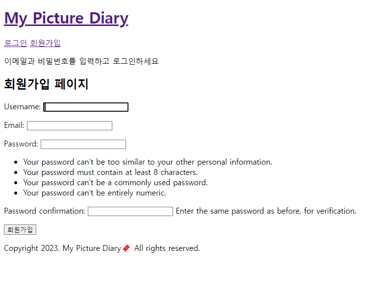

# my-picture-diary

나만의 그림일기 작성하기

## 개발 환경 및 개발 기간

- 개발 환경
  Django 4.2.3, HTML, CSS, JavaScript
- 개발 기간
  2023/07/17 ~ 2023/07/20

## 기능

- User : 회원가입, 로그인, 로그아웃
- Post : 게시글 CRUD. 일기의 그림 작성, 수정
- Comment : 댓글 작성, 삭제

## DB 구조

## URL

- '' : 인덱스 페이지

### 일기

- 'diary/' : 일기 리스트
- 'diary/write/' : 일기 작성
- 'diary/detail/<int:pk>/' : 일기 조회
- 'diary/detail/<int:pk>/delete/' : 일기 삭제
- 'diary/detail/<int:pk>/edit/' : 일기 수정

### 일기 댓글

- 'diary/detail/<int:pk>/comment/write/' : 댓글 작성
- 'diary/detail/<int:pk>/comment/delete/' : 댓글 삭제

### 사용자 페이지

- 'register/' : 회원가입 페이지
- 'login/' : 로그인 페이지
- 'logout/' : 로그아웃

## 실행 화면

## 아쉬웠던 점

- canvas 저장 부분을 해결해보려고 하다 시간이 너무 많이 지나 에러를 잡지 못한점
- css를 전혀 하지 못해 화면이 깔끔하지 못한 점
- 그림을 정상적으로 저장, 수정하지 못한 점
